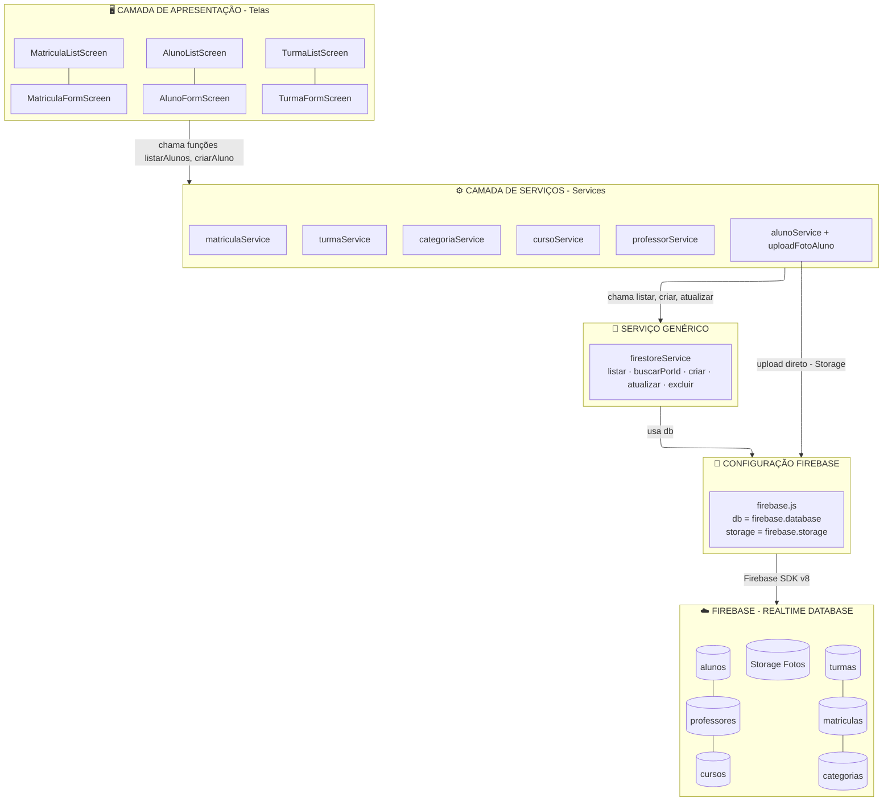

# 📱 App Acadêmico — Projeto Base de Programação Mobile

Aplicativo React Native com **Expo** e **Firebase** desenvolvido como projeto base para aulas de programação mobile.

---

## 🚀 Tecnologias utilizadas

| Tecnologia | Finalidade |
|---|---|
| React Native + Expo | Framework mobile multiplataforma |
| React Native Paper | Componentes de UI (Material Design) |
| React Navigation | Navegação entre telas |
| Firebase Firestore | Banco de dados em nuvem (NoSQL) |
| Firebase Storage | Armazenamento de fotos |
| expo-camera | Câmera nativa |
| expo-image-picker | Galeria de imagens |
| expo-location | GPS e geolocalização |
| expo-clipboard | Área de transferência |

---

## ⚙️ Configuração inicial

### 1. Instalar dependências
```bash
npm install
```

### 2. Configurar o Firebase
1. Acesse [console.firebase.google.com](https://console.firebase.google.com)
2. Crie um novo projeto
3. Ative o **Firestore Database** (modo teste)
4. Ative o **Storage**
5. Em Configurações do projeto → Seus aplicativos → SDK, copie as credenciais
6. Cole em `src/config/firebase.js`

### 3. Rodar o projeto
```bash
npx expo start
```
Escaneie o QR Code com o app **Expo Go** no celular.

---

## 📁 Estrutura do projeto

```
src/
├── config/
│   └── firebase.js          ← Configuração do Firebase
├── services/
│   ├── firebaseService.js  ← CRUD genérico reutilizável
│   ├── alunoService.js      ← CRUD + upload de foto
│   ├── professorService.js
│   ├── cursoService.js
│   ├── turmaService.js
│   ├── matriculaService.js
│   └── categoriaService.js
├── navigation/
│   └── AppNavigator.js      ← Tabs + Stacks de navegação
├── components/
│   ├── Header.js            ← Cabeçalho reutilizável
│   ├── Loading.js           ← Indicador de carregamento
│   └── ConfirmDialog.js     ← Diálogo de confirmação
└── screens/
    ├── MaisScreen.js        ← Menu de funcionalidades extras
    ├── alunos/              ← CRUD + foto de perfil
    ├── professores/         ← CRUD
    ├── cursos/              ← CRUD
    ├── turmas/              ← CRUD
    ├── matriculas/          ← CRUD
    ├── categorias/          ← CRUD
    └── recursos/
        ├── CameraScreen.js  ← Câmera nativa
        ├── MapaScreen.js    ← GPS + geocodificação reversa
        └── RecursosScreen.js← Vibração, Clipboard, Share
```

---

## 🏛️ Arquitetura em camadas

O projeto segue o padrão de **separação de responsabilidades** dividido em 5 camadas:




| Camada | Responsabilidade |
|---|---|
| 🖥️ **Telas** | Exibir dados e capturar input do usuário |
| ⚙️ **Services** | Lógica específica de cada entidade, oculta o nome da coleção |
| 🔧 **Serviço Genérico** | Operações CRUD reutilizáveis para qualquer coleção |
| 🔌 **firebase.js** | Configuração e inicialização do SDK |
| ☁️ **Firebase** | Persistência dos dados na nuvem |

> A seta do `alunoService` direto para `firebase.js` representa o caso especial do **upload de foto**, que acessa o Storage sem passar pelo serviço genérico.

---

## 📅 Plano de aulas sugerido — 80 horas

### MÓDULO 1 — Fundamentos React Native (16h)
| # | Conteúdo | Horas |
|---|---|---|
| 1 | Ambiente de desenvolvimento (Node, Expo, VS Code, Expo Go) | 2h |
| 2 | Componentes básicos: View, Text, StyleSheet, Image | 2h |
| 3 | React Navigation: Stack e Bottom Tabs | 2h |
| 4 | React Native Paper: Card, Button, TextInput, FAB, Avatar | 2h |
| 5 | Estado com useState e efeitos com useEffect | 2h |
| 6 | FlatList, ScrollView e renderização de listas | 2h |
| 7 | Componentes reutilizáveis (Header, Loading, ConfirmDialog) | 2h |
| 8 | **Avaliação Módulo 1** | 2h |

### MÓDULO 2 — Firebase e CRUD (20h)
| # | Conteúdo | Horas |
|---|---|---|
| 9 | Introdução ao Firebase: Firestore e estrutura de coleções | 2h |
| 10 | CRUD de Categorias (tela mais simples para iniciar) | 2h |
| 11 | CRUD de Professores | 2h |
| 12 | CRUD de Cursos (campos numéricos e validação) | 2h |
| 13 | CRUD de Alunos | 2h |
| 14 | CRUD de Turmas (relacionando com Professor e Curso) | 2h |
| 15 | CRUD de Matrículas (relacionando Aluno + Turma) | 2h |
| 16 | Picker/Dropdown para dados relacionados | 2h |
| 17 | useFocusEffect e recarregamento automático de listas | 2h |
| 18 | **Avaliação Módulo 2** | 2h |

### MÓDULO 3 — Recursos Nativos (22h)
| # | Conteúdo | Horas |
|---|---|---|
| 19 | expo-camera: tirar foto e exibir prévia | 2h |
| 20 | expo-image-picker: galeria e recorte de imagens | 2h |
| 21 | Firebase Storage: upload de fotos do aluno | 2h |
| 22 | expo-location: obter coordenadas GPS | 2h |
| 23 | Geocodificação reversa: converter coordenadas em endereço | 2h |
| 24 | react-native-maps: mapa interativo com marcadores | 2h |
| 25 | expo-notifications: notificações push locais | 2h |
| 26 | expo-barcode-scanner: leitura de QR Code | 2h |
| 27 | expo-local-authentication: login com biometria | 2h |
| 28 | Vibração, Clipboard e Share API nativa | 2h |
| 29 | AsyncStorage: dados offline e cache local | 2h |

### MÓDULO 4 — Projeto Final (22h)
| Atividade | Horas |
|---|---|
| Definição e planejamento do projeto final | 2h |
| Desenvolvimento orientado em aula | 14h |
| Apresentação dos projetos | 4h |
| Avaliação final | 2h |

---

## 💡 Ideias de funcionalidades para o projeto final

- **Check-in em aula via QR Code** — Aluno escaneia QR code para registrar presença
- **Galeria de fotos por turma** — Upload e exibição de fotos das aulas
- **Notificação de matrícula** — Push notification ao realizar nova matrícula
- **Login com biometria** — Autenticação do professor via digital/face
- **Mapa das unidades** — Localização das sedes do curso no mapa
- **Exportar lista de alunos** — Gerar e compartilhar PDF da lista da turma
- **Modo offline** — Funcionar sem internet com AsyncStorage

Snack is Open Source. You can find the code on the [GitHub repo](https://github.com/expo/snack).
